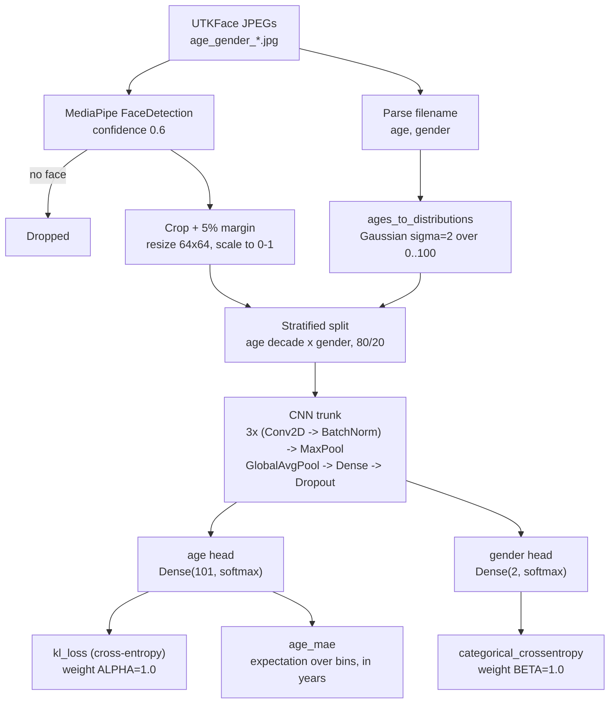

<h1 align="center">Age &amp; Gender Classifier</h1>

<p align="center">
  A multi-task CNN over UTKFace that predicts gender and age from one face crop —<br>
  age treated as a distribution over 101 one-year bins rather than a single number.
</p>

<p align="center">
  
  
  
  
  
  
  <a href="LICENSE.txt"></a>
  <br>
  <a href="https://susanqq.github.io/UTKFace/"></a>
  <br>
  <a href="https://vishnujan-narayanan.vercel.app/"></a>
  <a href="https://github.com/VishnujanNarayanan"></a>
  <a href="https://www.linkedin.com/in/vishnujan-narayanan"></a>
  <a href="https://substack.com/@vishnujannarayanan"></a>
</p>

<p align="center">
  🎯 <a href="#why-this-project-exists">Why</a> ·
  🧩 <a href="#architecture">Architecture</a> ·
  🧠 <a href="#design-decisions">Design Decisions</a> ·
  📊 <a href="#results">Results</a> ·
  ⚡ <a href="#installation">Installation</a> ·
  ⚠️ <a href="#limitations">Limitations</a> ·
  🗺️ <a href="#roadmap">Roadmap</a>
</p>

---

## Why this project exists

Age prediction is usually framed as regression on a single number, which throws away something
true about the label: a 30-year-old face is barely distinguishable from a 31-year-old one, and
the annotation itself is uncertain. Squared error treats a 1-year miss and a 20-year miss as
differing only in magnitude, not in kind.

This project instead represents each age as a **Gaussian distribution over 101 bins**, so a label
of 30 becomes soft mass across roughly 26–34 — which matches how uncertain the annotation actually
is. Gender is learned jointly from the same convolutional trunk, so both tasks share one face
representation.

## Features

- **Multi-task CNN** — one trunk, two heads: 101-way age distribution and 2-way gender.
- **Label Distribution Learning** — exact ages converted to Gaussians with σ = 2.0.
- **Cross-entropy over the age bins**, scored against the Gaussian target. An Earth Mover's
  Distance loss is kept behind `LOSS=emd`; see [Limitations](#limitations) for why it is not the
  default.
- **MediaPipe face detection** with a 5% margin crop, replacing naive centre-cropping.
- **Stratified splitting** by age decade × gender, so both are balanced across train and val.
- **Keras Tuner search** over filters, kernel size, dense width, dropout, and learning rate.
- **Gradio demo** (`scripts/demo.py`) — a face in, the detected crop and both predictions out.
- **Interpretable age metric** — MAE in years, recovered as the expectation of the predicted
  distribution rather than an argmax.

## Architecture



## Design Decisions

**Age is a distribution, not a scalar.** `ages_to_distributions` places a Gaussian with σ = 2.0
over the 0–100 grid and normalises it. A label of 30 becomes soft mass across roughly 26–34,
which matches how uncertain the annotation actually is.

**The age loss is cross-entropy against the Gaussian target.** Because the target is soft rather
than one-hot, a prediction centred on 32 for a 30-year-old still collects most of the target's
mass, so near misses are already cheaper than far ones.

An Earth Mover's Distance loss on the CDFs was the original choice and reads as the better idea —
it scales error with distance between bins. In practice it failed badly. EMD compares *cumulative*
distributions, so a wide flat prediction parked near the target's centre of mass is cheap: a
little wrong everywhere instead of very wrong somewhere. Since predicted age is the expectation of
that distribution, hedging wide reads as a mid-range guess. Every adult came back at 45.0, no
prediction in the held-out set ever exceeded it, and 35% of them landed in 44–45. Cross-entropy
offers no such refuge — probability has to sit where the age actually is. `LOSS=emd` reproduces
the old behaviour.

**Predicted age is the expectation, not the argmax.** `age_mae` dots the predicted
distribution with the age grid. This uses the whole distribution, and gives a metric in years that
means something to a reader.

**Faces are detected, not assumed centred.** MediaPipe finds the face and the crop is expanded 5%
on each side to keep the jaw and hairline, both of which carry age signal. Images with no detected
face are dropped rather than fed in as noise.

**The split is stratified on both labels jointly.** Indices are bucketed by
`(age // 10, gender)` and split 80/20 within each bucket, so no age band or gender is
concentrated on one side. Buckets with fewer than three samples go entirely to train, so
validation never contains a group the model has never seen.

**Both tasks are weighted equally** (`ALPHA = 1.0`). Cross-entropy is roughly ten times the
magnitude of the EMD it replaced, which needed `ALPHA = 5.0` to compete with the gender head;
keeping that weight here would swamp gender instead.

## Results

Measured on 2,019 held-out faces (`scripts/train.py`, three conv blocks into global average
pooling, 64×64 input, 348k parameters):

| Metric | Validation |
|---|---|
| Age MAE | **8.27 years** |
| Age correlation with truth | **0.879** |
| Gender accuracy | **0.842** |
| Prediction range | 1.6 – 90.7 (true range 1 – 100) |

Per age band, so the weak spots are visible rather than averaged away:

| True age | n | Mean prediction | MAE |
|---|---|---|---|
| 1–5 | 496 | 5.9 | 4.0 |
| 6–12 | 218 | 20.1 | 12.2 |
| 13–19 | 171 | 23.5 | 8.3 |
| 20–29 | 305 | 30.5 | 7.5 |
| 30–39 | 208 | 40.0 | 9.1 |
| 40–49 | 136 | 50.4 | 10.1 |
| 50–59 | 188 | 57.1 | 10.6 |
| 60–69 | 133 | 62.3 | 11.1 |
| 70+ | 164 | 74.2 | 9.8 |

Every band lands between 4 and 12 years. The 6–12 band is the worst of them, over-predicting by
about eight years on average.

**What the loss change was worth.** Under the EMD loss the same architecture reached 10.62 years
with a correlation of 0.786, and predictions never exceeded 45.0 — the 70+ band was 36.1 years of
error and 60–69 was 19.8. Switching to cross-entropy took those to 9.8 and 11.1. Gender moved the
other way by about a point, 0.853 to 0.842, which is noise at this sample size.

**Two other things were tried and were worse.** Inverse-frequency age weighting raised the ceiling
from 45 to 46 but cost more on the dense young bands than it won on the sparse old ones (MAE 12.61,
gender 0.803). A MobileNetV2 ImageNet backbone at 128×128 gave the best gender score of any run
(0.855) but the worst age (14.69) with predictions collapsing to 2–26. Both are kept behind
switches — `BALANCE=1` and `scripts/train_transfer.py` — so the comparison can be rerun.

Neither helped because the ceiling was never a capacity or a data problem: the training set is 13%
aged 45–59 and 14.5% over 60. It was the loss.

## Project Structure

```
Age_Gender_classifier/
├── scripts/prep.py                   # MediaPipe crop pass, cached to cache_faces.npz
├── scripts/train.py                  # Training + evaluation; produces the reported numbers
├── scripts/train_transfer.py         # Same task on a MobileNetV2 backbone, for comparison
├── scripts/render_grid.py            # Draws artifacts/prediction-grid.png from held-out faces
├── scripts/demo.py                   # Gradio demo over the saved model
├── artifacts/prediction-grid.png     # Nine held-out faces, predicted against actual
├── Image_Classifier!.ipynb           # Original notebook: MediaPipe crop, LDL, EMD, tuner
├── Image_classifier_multitask.ipynb  # Multi-task variant
├── image_classifier2_multitask.ipynb # Multi-task variant
├── image3.ipynb                      # Earlier experiment
├── Image_classifier.ipynb            # Earlier experiment
├── image_classifier2.ipynb           # Earlier experiment
├── extract.py                        # Flattens UTKFace .tar.gz parts into one image directory
├── UTKFace/images_flat/part1/        # Expected image location (not committed)
├── tuner/age_gender/                 # Keras Tuner search state
├── requirements.txt
├── LICENSE.txt
└── README.md
```

`Image_Classifier!.ipynb` is the current pipeline; the other notebooks are earlier iterations kept
for reference.

## Installation

Clone the repository:

```bash
git clone https://github.com/VishnujanNarayanan/Image_classifier.git
cd Image_classifier
```

Create a virtual environment and install dependencies:

```bash
python -m venv env
source env/bin/activate      # Linux / macOS
env\Scripts\activate         # Windows
pip install -r requirements.txt
pip install mediapipe==0.10.9 keras-tuner
```

`mediapipe` and `keras-tuner` are installed by the notebook's first cells but are **not** listed
in `requirements.txt`.

### Getting the data

Download [UTKFace](https://susanqq.github.io/UTKFace/). Filenames encode the labels as
`age_gender_race_date.jpg`, which is what the loader parses. If the download arrives as `.tar.gz`
parts, `extract.py` flattens them into a single directory:

```bash
python extract.py    # edit source_dir and target_dir first — both are absolute Windows paths
```

Then point `DATA_DIR` in the notebook at the resulting folder.

## Usage

```bash
jupyter notebook "Image_Classifier!.ipynb"
```

Set `DATA_DIR` in the config cell, then run top to bottom. The notebook preprocesses every image
through MediaPipe, builds the age distributions, runs the tuner search, and trains the selected
model.

## Configuration

All settings live in one config cell:

| Setting | Value | Meaning |
|---|---|---|
| `DATA_DIR` | absolute path | Directory of UTKFace JPEGs |
| `IMG_SIZE` | 64 | Input resolution after cropping |
| `SIGMA` | 2.0 | Gaussian spread for label distributions |
| `ALPHA` | 1.0 | Age loss weight |
| `BETA` | 1.0 | Gender loss weight |
| `BATCH_SIZE` | 64 | Training batch size |
| `EPOCHS` | 15 | Training epochs |
| `AGE_MAX` | 100 | Ages clipped to this maximum |
| `NUM_BINS` | 101 | Age bins, 0–100 inclusive |
| Face detection confidence | 0.6 | `min_detection_confidence` |
| Crop margin | 5% | Expansion around the detected box |

### Tuner search space

| Hyperparameter | Values |
|---|---|
| `filters1` | 32, 64, 128 |
| `kernel1` | 3, 5 |
| `dense_units` | 128, 256, 512 |
| `dropout` | 0.2 – 0.5, step 0.1 |
| `lr` | 1e-2, 1e-3, 1e-4, 1e-5 |

## Example Workflow

1. Download UTKFace and flatten it into one directory of JPEGs.
2. Point `DATA_DIR` at that directory.
3. Run the loading cell. Each filename is split on `_` to recover age and gender; ages are
   clipped to 0–100; MediaPipe crops the face. Images with no detected face are dropped and
   counted in `bad_files`.
4. Run `ages_to_distributions` to convert exact ages into 101-bin Gaussians.
5. Run the split cell — indices are grouped by `(age decade, gender)` and split 80/20 within each
   group.
6. Run the tuner, then train the selected model. `ValReporter` prints true-age MAE in years after
   every epoch.
7. Run the plotting cell for MAE, accuracy, and loss curves.

## Dependencies

| Package | Why |
|---|---|
| `tensorflow` / `keras` | Model definition, custom EMD loss, training loop |
| `keras-tuner` | Hyperparameter search over the CNN and optimiser |
| `mediapipe` | Face detection for cropping |
| `opencv-python` | Image reading, colour conversion, resizing |
| `numpy` | Label distribution construction and array handling |
| `scikit-learn` | `train_test_split`, MAE and accuracy helpers |
| `matplotlib` | Training curves |

## Limitations

- **8.27-year age MAE is still weak.** Published UTKFace results using deeper backbones reach
  substantially lower error.
- **Children aged 6–12 are over-predicted by about eight years**, the worst band in the set. Ages
  1–5 are the most accurate at 4.0 years, so the failure is specific rather than a general
  young-face problem.
- **Gender sits at 0.842** against a 0.552 majority-class baseline — real, but not strong.
- **64×64 input discards fine detail** — skin texture and wrinkles are exactly the age signal.
  The 128×128 cache built for `train_transfer.py` exists but the main model does not use it.
- **A pretrained backbone did not help.** MobileNetV2 scored the best gender of any run and the
  worst age. Whether that is the fine-tuning schedule or the resolution is untested.
- **The notebook is no longer the reference implementation.** `Image_Classifier!.ipynb` still
  runs its own keras-tuner search with the EMD loss and does not carry the change described
  above; `scripts/train.py` is what produces the reported numbers.
- **`extract.py` has hardcoded absolute paths** and does not accept arguments.
- **`mediapipe` and `keras-tuner` are missing from `requirements.txt`**, and no versions are
  pinned.
- **`UTKFace/images_flat/part1/` is empty in this checkout** — the data is not committed.
- **The tuner-selected model and the manually built `model` are trained in separate cells**
  (cells 13 and 14), so which model produced the reported figures depends on execution order.
- **No model is saved.** Weights exist only in the kernel.
- **Six notebooks are committed**, most of them superseded, which makes the entry point unclear.
- **Ethnicity is present in the UTKFace filenames but unused.** Any deployment should consider
  whether accuracy is uniform across groups — that is not measured here.

## Roadmap

- Add augmentation: horizontal flips, small rotations, brightness and scale jitter.
- Deepen the trunk to three or four convolutional blocks with global average pooling instead of
  `Flatten`.
- Raise input resolution to 128×128.
- Add early stopping and a learning-rate schedule on validation loss.
- Tune `ALPHA` / `BETA`, or normalise the two losses onto a common scale.
- Try transfer learning from a pretrained face backbone.
- Move `DATA_DIR` and the `extract.py` paths into arguments.
- Pin all dependencies, including `mediapipe` and `keras-tuner`.
- Save the trained model and add a standalone inference script.
- Report accuracy broken down by the ethnicity label to check for uneven performance.
- Consolidate the six notebooks down to one.

## License

Released under the MIT License — see [LICENSE.txt](LICENSE.txt).

The UTKFace dataset is provided by its authors for **non-commercial research purposes only**;
its terms apply independently of this repository's licence.

## Acknowledgements

[UTKFace](https://susanqq.github.io/UTKFace/) — over 20,000 face images annotated with age,
gender, and ethnicity (Zhang, Song &amp; Qi).

## Author

<p align="center">
  <strong>Vishnujan Narayanan</strong>
</p>

<p align="center">
  <a href="https://vishnujan-narayanan.vercel.app/"></a>
  <a href="https://github.com/VishnujanNarayanan"></a>
  <a href="https://www.linkedin.com/in/vishnujan-narayanan"></a>
  <a href="https://substack.com/@vishnujannarayanan"></a>
</p>
